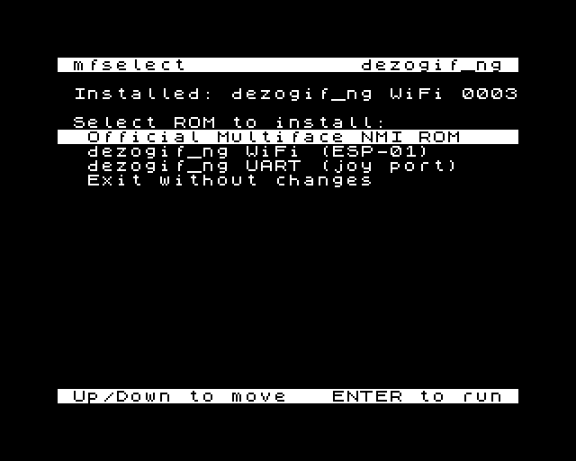

# dezogif_ng — a ZX Spectrum Next debug stub over WiFi

A Z80 debug stub that runs on **real ZX Spectrum Next hardware** and is debugged from a PC with
[DeZog](https://github.com/maziac/DeZog) in VS Code, speaking DZRP.

It is a fork of [maziac/dezogif](https://github.com/maziac/dezogif), whose transport is a serial
cable on the joystick port. This fork **adds a second transport over the Next's on-board ESP-01
WiFi module** — the same UART peripheral behind a pin mux — selected **at assembly time**, so the
ROM builds in either UART mode or WiFi mode. The serial transport is not removed. WiFi mode drops
the cable, leaves the joysticks with the game permanently, and opens a route for **PC-initiated
break**, which the serial version cannot do.

~~None of it is written yet: what is here today is upstream's serial stub, plus this project's
build, test bench and documentation.~~ **That was true when this file was written and has not
been since 2026-08-05.** What is here today:

- **The WiFi transport is built and has run on real hardware.** `make TRANSPORT=wifi` gives a ROM
  that brings the ESP-01 up as a TCP server and speaks DZRP through it. On a real Next, **DeZog
  itself** has attached over WiFi and disassembled, read registers and memory, single-stepped,
  broken in with the M1 button and reattached (2026-08-05, median **13.0 ms** round trip). The
  best measured latency is **11.2 ms**, from the conformance bench's own hardware run three days
  later — a different session, and not a DeZog one.
- **PC-initiated break is built**, milestone M2, 2026-08-11 — Pause in DeZog stops a freely
  running program with no button press and no breakpoint. The two Copper instructions that make it
  possible live in **your** program, 44 bytes; see
  [doc/ASYNCHRONOUS-BREAK-USER-HOWTO.md](doc/ASYNCHRONOUS-BREAK-USER-HOWTO.md), including the five
  states in which it will not fire. **This is the one part that has NOT run on hardware.**
- **Both ROMs go on the SD card together** and are switched from the machine, either from a menu
  (`mfselect`) or from the NextZXOS command line and `AUTOEXEC.BAS` (`.mfinstall`), so choosing
  the serial build for a program that owns the ESP costs a power cycle rather than a PC session.
- **The bench is local, headless and jnext-driven** — `make test` is the gate, with a dozen more
  targets behind it; bare `make` lists every one.

Maintained by [jorgegv](https://github.com/jorgegv). Original author: maziac.

**Status: usable, and in active development.** Read
[doc/ZXNEXT-REMOTE-DEBUG-STUB.md](doc/ZXNEXT-REMOTE-DEBUG-STUB.md) first — it carries the plan, the
VHDL-verified hardware facts with citations, and an appendix recording which claims are verified,
which were reported on hardware, and which are still estimates.

# Design

There are basically 2 states:
- the debugged program is running
- the debugged program is stopped

When the debugged program is running no communication takes place and the joy ports are restored for joystick usage.
When the debugged program is stopped the dezogif takes over and configures the joy port for UART communication.

This implies that it is not possible to stop the debugged program from DeZog.
To stop it you need to press the yellow NMI button.

> **This section describes upstream's serial design, and it is still exactly right for UART mode.
> For the WiFi build the sentence above is no longer true — see the note below the diagram.**

When the NMI button was pressed dezogif sends a DZRP pause notification to DeZog to notify about the state change. Then dezogif will wait for further requests from DeZog, e.g. to read register values etc.

The program is started when DeZog sends a DZRP continue request.

See [Design.md](doc/legacy/Design.md) for more info.

~~Lifting the "cannot stop from DeZog" limitation is the point of this fork; the mechanism is a
Copper-driven periodic NMI, and it is milestone M2 of the plan.~~

**IT IS LIFTED, in the WiFi build, since 2026-08-11 — milestone M2, issue #22.** Pause in DeZog
stops a freely running program, with no button press and no breakpoint (bench check **W8**). The
mechanism is the Copper-driven periodic NMI above, and the two Copper instructions live in **your
program**, not in the debugger — 44 bytes, because the Copper's instruction list is write-only and
a debugger that installed its own could never give you yours back. See
[doc/ASYNCHRONOUS-BREAK-USER-HOWTO.md](doc/ASYNCHRONOUS-BREAK-USER-HOWTO.md) for the snippet, what
it costs, and the five states in which the break will not fire.

**The paragraphs above still describe UART (serial) mode exactly**, which has no PC-initiated break
and will not get one: a serial build hands the joy ports back when it resumes your program, which
re-points the UART's receive line at the ESP-01 pin, so the PC's cable bytes have nowhere to land
while the program runs. There, the yellow NMI button is still the only way to stop it.

**None of M2 has run on real hardware.** Every result behind it is the jnext bench's.

# Build

The assembler is [sjasmplus](https://github.com/z00m128/sjasmplus). Running `make` with no target
lists everything available:

~~~
make all        # everything: both ROMs, both .sums, mfselect, mfinstall, the program, the unit tests
make mf-rom     # build/enNextMf.rom on its own, the deployable artefact
make mfselect   # just the on-Next ROM switcher and what it installs (see Deployment)
make mfinstall  # the .mfinstall dot command, which installs a ROM WITHOUT touching the card
~~~

Build output goes to `build/`, and **`make all` really does build all of it** — both transport
variants, their checksum sidecars, and `build/deploy/` ready to copy to the card.

`mfselect` and `mfinstall` are the components built with [z88dk](https://github.com/z88dk/z88dk)
rather than sjasmplus — one exception aside: `tools/mfinstall/mfwin.asm`, which has to be assembled
at a fixed address and so cannot be a C function. See [doc/MFINSTALL.md](doc/MFINSTALL.md).

# Testing

~~~
make test
~~~

runs a local headless test bench in the [jnext](https://github.com/jorgegv/jnext) emulator — no
VS Code, no hardware. It installs the freshly built ROM into a copy of an SD card image, boots a
Next, fires a Multiface NMI from guest code and judges the resulting screenshots. `make
check-reproducible` verifies that a pinned `BUILD_TIME` yields a byte-identical ROM.

~~~
make test-mfselect
~~~

runs mfselect's own bench: six headless jnext runs, ten checks, asserting mostly on the files
pulled back off the SD image rather than on pixels — that the stock ROM is captured
byte-identically, that the on-Next and host checksums agree, that each of our two ROMs installs,
that mfselect refuses to mistake *either* of them for the original, that the ROM it says is
installed is the one that is, and that a backup left short by an interrupted capture is detected
and taken again rather than trusted. It is not part of `make test`.

~~~
make test-mfinstall
~~~

runs the `.mfinstall` bench: twelve headless jnext runs, nine checks. `.mfinstall` writes a ROM into
Multiface **SRAM** through the Next's config mode, so the change is live at the next NMI press and
no ROM is ever written to the SD card — which is what one of its two control checks asserts, byte
for byte. The other builds the same code with DivMMC left mapped, one assembler constant apart, and
requires the write to be blocked — which is what attributes the mechanism to that constant. Its
strongest check presses the M1 button straight after an install and requires the stub's own screen,
with no soft reset. Also not part of `make test`. See [doc/MFINSTALL.md](doc/MFINSTALL.md).

~~The Z80 unit tests under `src/unit_tests/` are DeZog-driven and need VS Code; they are a manual
layer.~~ **Half of that has been untrue since issue #3 (2026-08-04)** and the sweep for this
commit's own subject is what found it still standing:

~~~
make test-unit
~~~

runs **28 of the 64** test cases headlessly in jnext, judged on markers the guest prints — the
banking and breakpoint code, all of `ut_backup.asm`, `ut_breakpoints.asm` and `ut_utilities.asm`.
Do not read a green run as "the unit tests pass"; read it as "the 28 that can run, pass". The
other **36 cannot ever run headlessly**: they need ports invented by `src/simulation/uart.js`, a
JavaScript peripheral DeZog's zsim loads as `customCode`, and the Z80 cannot trap its own I/O. For
those, the DeZog-driven layer above is still the only way, and still needs VS Code.

# Deployment

The stub **is** the Multiface ROM: one of `build/enNextMf.rom` (UART) or
`build/enNextMf-wifi.rom` (WiFi) replaces `machines/next/enNextMf.rom` on the Next's SD card.
**The card already has one, and it is the stock Multiface ROM — you must keep a copy of it.**
Without one you cannot get the normal Multiface back, and you will want it back every time the stub
misbehaves.

There are two ways to do that swap.

## Recommended: mfselect, on the Next itself

`mfselect` is a small NextZXOS utility that switches the installed Multiface ROM between the stock
one and **either** of this project's two builds, with the card still in the machine. It captures
the stock ROM the first time it runs, so the backup is made for you rather than being something you
must remember.

Install it once. `make mfselect` (or `make all`) leaves everything it needs in **`build/deploy/`**,
under the exact names *and in the directories* the card expects — so copy the whole thing to the
root of the card and keep the layout:

~~~
build/deploy/  →  the root of the card
    mfselect/mfselect.nex
    mfselect/dezowifi.rom
    mfselect/dezowifi.sum
    mfselect/dezouart.rom
    mfselect/dezouart.sum
~~~

i.e. `cp -r build/deploy/* /path/to/card/`.

**Nothing needs renaming and nothing needs placing by hand.** The ROMs are built as `enNextMf.rom`
and `enNextMf-wifi.rom`, because that is the name the Next's firmware loads at boot — but mfselect
looks for them beside itself as `dezouart.rom` and `dezowifi.rom`. `build/deploy/` exists so that
the same bytes wearing two different names, in two different directories, is the build's problem
rather than yours. `make mfinstall` adds `dot/mfinstall` and a default `mfselect/mfinstall.yml` to
the same tree — see [MFINSTALL.md](doc/MFINSTALL.md).

One build produces all five with the same `BUILD_TIME`, which is what makes them a coherent set:
the stamp goes into each ROM, so every build has a different checksum and a `.rom` paired with a
`.sum` from another build is refused.

Then, from the NextZXOS command line:

~~~
.nexload /mfselect/mfselect.nex
~~~

Up/Down to move, ENTER to choose:

*A real screenshot, taken by `make test-mfselect` from a headless jnext run — not a mock-up, so it
cannot drift from what the program actually draws.*

**Both of our builds are offered**, because a debuggee that uses the ESP itself cannot be debugged
over WiFi and the serial ROM is the answer for it. `Installed:` names which one is on the card, and
its build number, read from a magic string inside the ROM rather than from a checksum — so it stays
correct after the stub is rebuilt.

Whichever is chosen is copied over the official path and **verified by reading it back**. Then
**power-cycle the machine** — switch it off and on. The Multiface ROM is read at power-on, so
nothing changes until then.

On its very first run mfselect offers to save the currently installed ROM as the original. It
refuses to do that if what is installed is already one of this project's ROMs — either of them —
because saving the debug stub as "the original" would lose the stock Multiface ROM with no copy
left on the card. If you have already installed the stub by hand, restore the stock ROM before
running mfselect, or its backup will simply never be made.

Full detail, including the checksum scheme: [doc/MFSELECT.md](doc/MFSELECT.md).

## By hand

Put the card in a PC, back up `machines/next/enNextMf.rom` somewhere safe, and copy the variant you
want over it — `build/enNextMf-wifi.rom` for WiFi, `build/enNextMf.rom` for the joy-port serial
link. Changing your mind later means doing it again; mfselect exists so that it does not.

## Using the stub

Once installed, the stub starts after NextZXOS has booted, by pressing the yellow NMI button. To
re-initialise later, hold "Symbol Shift" (or CTRL) while hitting the NMI button.

Note: the stub is known to work with ZX Next core 03.01.10 and 03.02.00. It will not work on older
cores — stackless NMI, which it depends on, does not exist there.

# License

This project is licensed under the [GNU General Public License v3](LICENSE).

It is a derivative work of [maziac/dezogif](https://github.com/maziac/dezogif), which is under
the MIT licence. That notice is retained in [NOTICE](NOTICE) and still governs maziac's original
code; the GPLv3 covers the combined work.

# Acknowledgements

To **maziac**, for dezogif and for DeZog itself. Everything above the byte stream here — the
memory choreography, the AltROM trick, the breakpoint design, the DZRP command layer — is
maziac's work, and this fork would have been months of rediscovery without it.

And, in maziac's own words from the original readme:

> Many thanks to Chris Kirby. I have used his NDS code
> https://github.com/Ckirby101/NDS-NextDevSystem as starting point and used e.g. his routine to
> set the baudrate.
